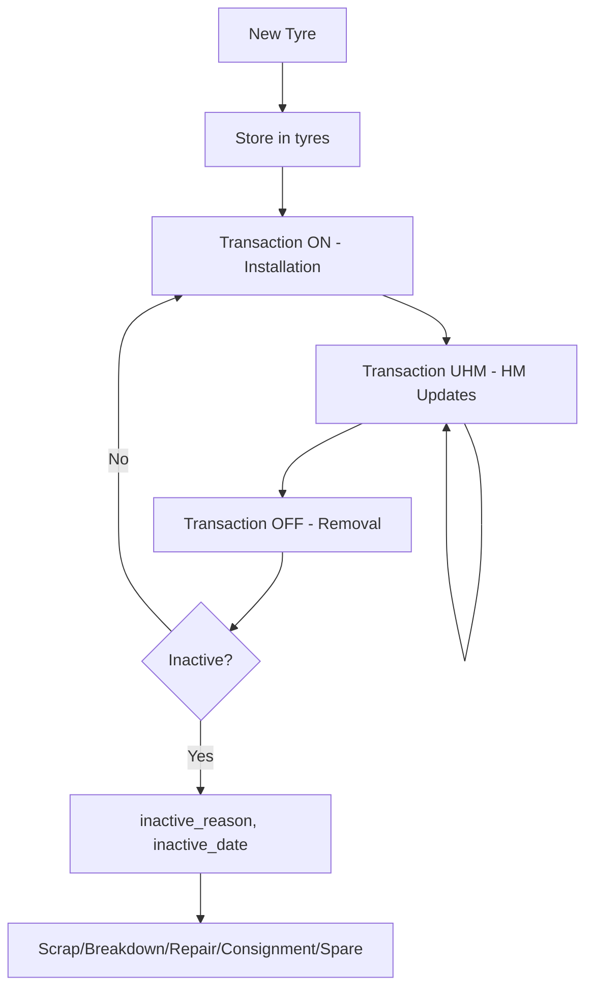
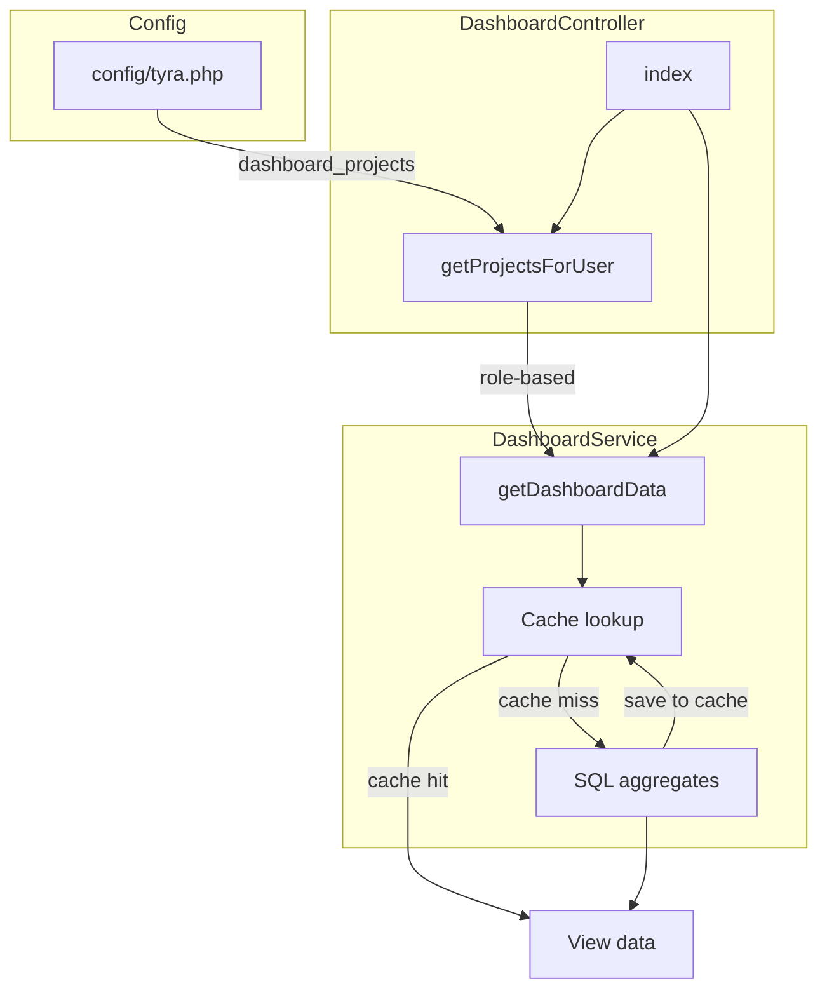

Purpose: Technical reference for understanding system design and development patterns
Last Updated: 2025-02-13

## Architecture Documentation Guidelines

### Document Purpose

This document describes the CURRENT WORKING STATE of the application architecture. It serves as:

- Technical reference for understanding how the system currently works
- Onboarding guide for new developers
- Design pattern documentation for consistent development
- Schema and data flow documentation reflecting actual implementation

### What TO Include

- **Current Technology Stack**: Technologies actually in use
- **Working Components**: Components that are implemented and functional
- **Actual Database Schema**: Tables, fields, and relationships as they exist
- **Implemented Data Flows**: How data actually moves through the system
- **Working API Endpoints**: Routes that are active and functional
- **Deployment Patterns**: How the system is actually deployed
- **Security Measures**: Security implementations that are active

### What NOT to Include

- **Issues or Bugs**: These belong in `MEMORY.md` with technical debt entries
- **Limitations or Problems**: Document what IS working, not what isn't
- **Future Plans**: Enhancement ideas belong in `backlog.md`
- **Deprecated Features**: Remove outdated information rather than marking as deprecated
- **Wishlist Items**: Planned features that aren't implemented yet

### Update Guidelines

- **Reflect Reality**: Always document the actual current state, not intended state
- **Schema Notes**: When database schema has unused fields, note them factually
- **Cross-Reference**: Link to other docs when appropriate, but don't duplicate content

### For AI Coding Agents

- **Investigate Before Updating**: Use codebase search to verify current implementation
- **Move Issues to Memory**: If you discover problems, document them in `MEMORY.md`
- **Factual Documentation**: Describe what exists, not what should exist

---

# System Architecture

## Project Overview

**Tyra** is a Tyre Management System for mining operations. It tracks heavy equipment tyres through their lifecycle: inventory, installation (ON), removal (OFF), hour meter updates (UHM), cost-per-hour (CPH) analytics, and reporting by project and brand.

Core domain: Tyres → Transactions → Reports. Projects are mining sites (017C, 021C, 022C, 023C, 025C).

## Technology Stack

- **Backend**: Laravel 10, PHP 8.1+
- **Frontend**: Blade templates, AdminLTE, Vite, Axios
- **Database**: MySQL
- **Auth**: Laravel Sanctum, Spatie Laravel Permission
- **Key Packages**: Yajra DataTables, Maatwebsite Excel, Guzzle HTTP, SweetAlert

## Core Components

| Component | Location | Purpose |
|-----------|----------|---------|
| TyreController | `app/Http/Controllers/TyreController.php` | Tyre CRUD, search, activate/inactive, HM reset |
| TransactionController | `app/Http/Controllers/TransactionController.php` | ON/OFF/UHM transactions, HM updates |
| DashboardController | `app/Http/Controllers/DashboardController.php` | Dashboard KPIs, project-based filtering by role, delegates to DashboardService |
| DashboardService | `app/Services/DashboardService.php` | Tyre aggregates, rekap by project/brand, CPH calculations, 10-min cache |
| ToolController | `app/Http/Controllers/ToolController.php` | Projects, equipments API, getLastHm, helper methods |
| UserController | `app/Http/Controllers/UserController.php` | User CRUD, roles, activate/deactivate |
| ReportController | `app/Http/Controllers/ReportController.php` | Tyre rekaps, export |
| ReportTransactionController | `app/Http/Controllers/ReportTransactionController.php` | Transaction reports, export |
| MigrationController | `app/Http/Controllers/MigrationController.php` | Legacy data migration (tyres, transactions) |

## Database Schema

### Core Tables

**tyres**
- `id`, `serial_number`, `size_id`, `brand_id`, `pattern_id`, `supplier_id`, `created_by`
- `current_project`, `accumulated_hm`, `price`, `is_active`, `is_new`
- `otd`, `pressure`, `po_no`, `do_no`, `do_date`, `receive_date`, `prod_year`, `hours_target`
- `inactive_reason` (enum: Scrap, Breakdown, Repair, Consignment Rotable, Spare), `inactive_date`, `inactive_notes`
- `TyreSize`, `TyreManufName`, `TyrePattern`, `TyreVendor`, `TyreCPH` (migration compat)
- `warranty_exp_date`, `warranty_exp_hm`, `last_hm_before_reset`

**transactions**
- `id`, `tyre_id`, `date`, `unit_no`, `tx_type` (ON | OFF | UHM), `position`, `hm`, `rtd1`, `rtd2`
- `project`, `removal_reason_id`, `action`, `remark`, `created_by`, `updated_by`

**users**
- `id`, `name`, `username`, `email`, `password`, `project`, `department_id`, `is_active`
- Uses Spatie: `model_has_roles`, `role_has_permissions`, `roles`, `permissions`

**departments**
- `id`, `department_name`, `akronim`

** Supporting: tyre_sizes, tyre_brands, patterns, suppliers, removal_reasons, announcements, activity_logs**

### Entity Relationships

```
User ──┬── Departments (belongsTo)
       ├── Announcements (hasMany, created_by)
       └── Roles (Spatie HasRoles)

Tyre ──┬── TyreSize, TyreBrand, Pattern, Supplier (belongsTo)
       ├── User (created_by)
       └── Transaction (hasMany)

Transaction ──┬── Tyre (belongsTo)
              ├── RemovalReason (belongsTo)
              └── User (created_by)
```

## Route Structure

| Prefix | Controller | Key Actions |
|--------|------------|-------------|
| `/` | redirect | → dashboard |
| `/login`, `/register` | LoginController, RegisterController | auth (guest) |
| `/users` | UserController | index, store, edit, activate, deactivate, roles_user_update, change_password |
| `/roles`, `/permissions` | RoleController, PermissionController | RBAC |
| `/dashboard` | DashboardController | index, test |
| `/tyres` | TyreController, ToolController | search, data, create, store, activate, inactive, reset_hm, get_last_hm |
| `/transactions` | TransactionController | CRUD, data, updateHm |
| `/tyre-sizes`, `/tyre-brands`, `/patterns`, `/suppliers`, `/removal-reasons` | Respective controllers | CRUD, data |
| `/announcements` | AnnouncementController | CRUD, toggle_status |
| `/equipments` | EquipmentController | index, data (external API) |
| `/reports/tyre-rekaps`, `/reports/transactions` | ReportController, ReportTransactionController | index, data, export |
| `/migrations` | MigrationController | tyres, transactions (legacy migration) |

## Data Flow

### Tyre Lifecycle



### Dashboard Rekap Flow



**Dashboard data flow**: `DashboardController::getProjectsForUser()` resolves projects by role (superadmin/admin see all from `config/tyra.dashboard_projects`; others see only `auth()->user()->project`). `DashboardService::getDashboardData($projects)` returns cached aggregates (10 min TTL) or runs SQL aggregates. Cache invalidated on Tyre/Transaction save via model booted events.

### Dashboard View Structure

```
resources/views/dashboard/
├── index.blade.php          # Main layout; includes partials
├── announcements.blade.php  # Active announcements
├── mini_boxes.blade.php     # 4 KPIs: active count, inactive count, avg CPH active/inactive
├── chart_card.blade.php     # Active Tyres by Project chart (canvas)
├── chart_active_tyres.blade.php  # Chart.js script
├── rekap.blade.php          # Rekap by project table
├── by_brand_by_project.blade.php # Rekap by brand by project (table-responsive)
└── rekap_by_brand.blade.php # Commented out in index
```

### getLastHm (AJAX)

```
Request: GET /tyres/get-last-hm?tyre_id={id}
Response: { success, current_hm }
Used by: Tyre create/update forms for HM input
```

## Security Implementation

- **Auth**: `auth` middleware on all non-guest routes
- **Guest**: login, register only
- **RBAC**: Spatie Permission; roles: superadmin, admin, user
- **UserController::data()**: superadmin sees all users; others exclude superadmin
- **TyreController**: non-admin users filtered to `auth()->user()->project` for new tyre projects
- **DashboardController**: superadmin/admin see all projects; others see only `auth()->user()->project` (see `getProjectsForUser()`)
- **CSRF**: Laravel VerifyCsrfToken
- **Password**: Hash::make, min 6 chars

## Key Files Reference

| Concern | File |
|---------|------|
| Routes | `routes/web.php` |
| Middleware | `bootstrap/app.php` (Laravel 11 style) |
| Tyre model | `app/Models/Tyre.php` |
| Transaction model | `app/Models/Transaction.php` |
| Dashboard aggregates | `App\Services\DashboardService` |
| Dashboard projects | `config/tyra.php` → `dashboard_projects` |
| Dashboard cache | `Cache::remember` 10 min; invalidated on Tyre/Transaction save |
| Projects list (full) | `ToolController::defaultprojects()` |
| Migrations | `database/migrations/` |

## Deployment

- PHP artisan serve (dev) or standard Laravel deployment (Apache/Nginx)
- Vite for frontend assets: `npm run dev` / `npm run build`
- Environment: `.env` for DB, `URL_EQUIPMENTS` for external equipment API
